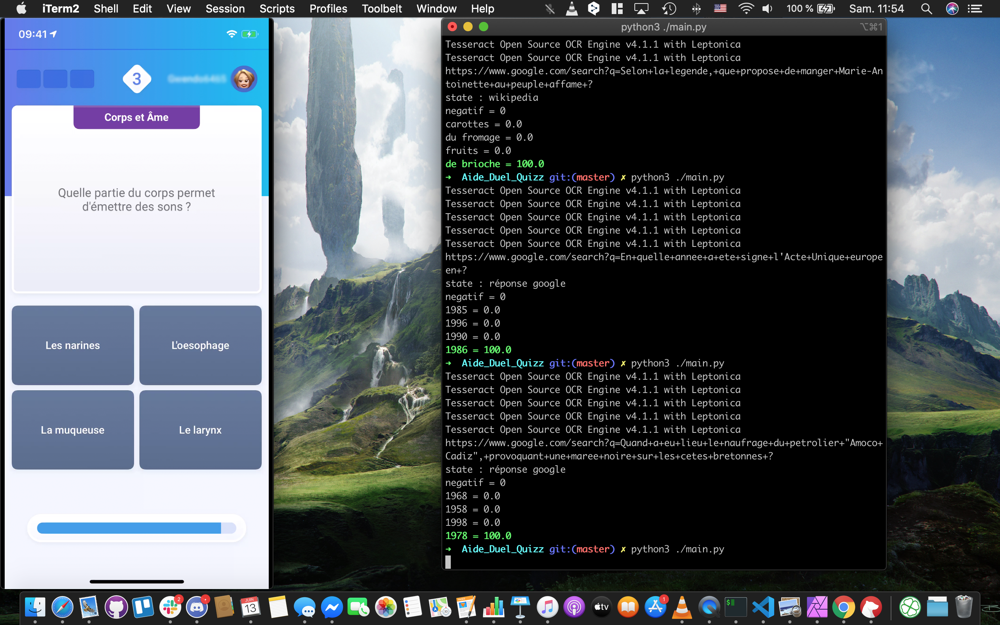

Aide_Duel_Quizz
==
Aide_Duel_Quizz est un programme vous aidant à trouver les réponses au jeu "Duel Quizz" sur iphone

Configuration
===
Le programme a été créé pour fonctionner avec un iphone X et un Macbook pro 13'.

Pour que le programme fonctionne, il faut brancher l'iphone sur le Macbook et utiliser Quicktime pour afficher l'écran du téléphone.

On est dans cette configuration:

Si vous utilisez un autre téléphone ou un autre pc et que cela ne fonctionne pas, vueillez changer la partie " SCREEN ET ANALYSE DE L'IMAGE"

Utilisation
===

On se place dans la configuration comme sur la photo (affichage de l'écran de l'iphone à droite, le programme Aide_Duel_Quizz à gauche)

Lorsque l'écran avec la question et les 4 réponses apparaissent,on lance le programme qui donnera la réponse en vert

Fonctionnement
===
Pour trouver la bonne réponse, Aide_Duel_Quizz va :
- il va d'abord lancer une recherche sur www.google.com avec la question récupérée sur l'image
- si google donne la réponse directement (en proposant un extrait d'un article ou tout simple la réponse), le programme va compter le nombre de fois qu'apparaît chaque réponse dans cette partie et donne un pourcentage d'apparition pour chaque réponse
- s'il n'y a pas de réponse, il va récupérer le 1er lien wikipedia et le programme va compter le nombre de fois qu'apparaît chaque réponse dans cette partie et donne un pourcentage d'apparition pour chaque réponse
- Si finalement il n'y a rien, le programme va compter le nombre de fois qu'apparaît chaque réponse dans la page principale de recherche (www.google.com) et donne un pourcentage d'apparition pour chaque réponse

Amélioration
===
Le programme ne fonctionne pas à 100%, cependant il permet d'avoir un score d'environ 14/18. Il ne faut pas oublier que c'est une aide au cas où on ne sait pas la réponse. Son fonctionnement est basé sur le google home (qui fait ses recherches de la même manière). Mais il peut être amélioré en faisant une recherche sur tous les liens de la page
